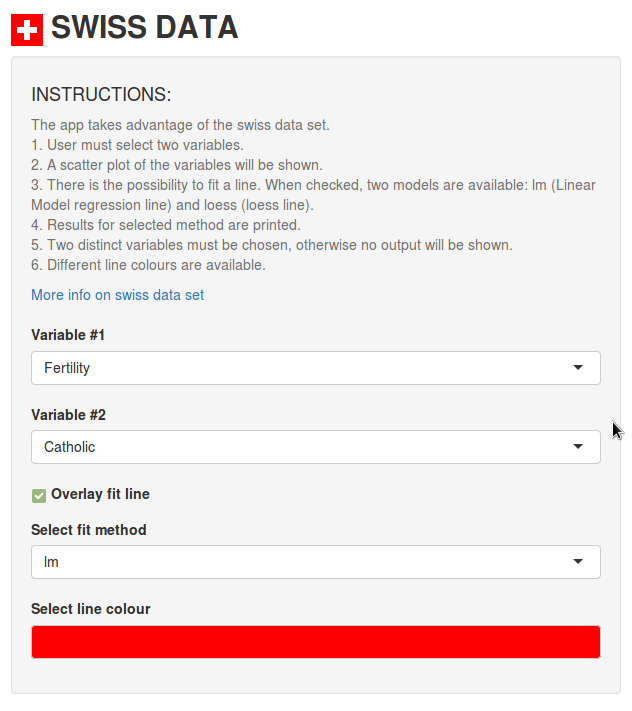
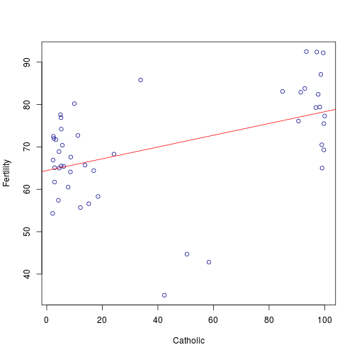

<style type="text/css">

.section .reveal .state-background {
    background: white;}
.section .reveal h1,
.section .reveal p {
    color: black;
    position: relative;
    top: 4%;}
.small-code pre code {
  font-size: 1em;
}    
.ribbon {
  position: fixed;
  top:0%;
  right:0%;
}
.titleimage {
    position: fixed;
    top: 95%;
    left: 90%;
}
</style>

EXPLORATORY APP (Swiss Data) 
========================================================
author: Javier Angoy
font-family: 'Risque'
date: November 20th, 2017
transition: rotate
    
<div class="titleimage" style="margin-left:-300px; margin-top:-300px;">

</div>

INTRODUCTION
========================================================
incremental: true

<div class="ribbon">
    </img></div>

- The app takes advantage of the built-in R-dataset 'swiss'. 
- The dataset gives 'fertility measures and socio-economic indicators for French-speaking provinces of Switzerland in about 1888'.
- The objective is to make exploratory graphs and seek possible relations between variables of the dataset.
- [Shiny app site](https://fjavierangoy.shinyapps.io/assignmentapp)
- [Link to github repository](https://github.com/fjavierGIT/C9S4_Course_Project-Shiny_App_Repp_Pitch)

INSTRUCTIONS
========================================================
left: 40%

<div class="ribbon">
    </img></div>
   

***
* <small>User must select two variables.</small>
* <small>A scatter plot of the variables will be shown.</small>
* <small>There is the possibility to fit a line. When checked, two models are available: lm (Linear Model regression line) and loess (loess line).</small>
* <small>Results for selected method are printed.</small>
* <small>Two distinct variables must be chosen, otherwise no output will be shown.</small>
* <small>Different line colours are available.</small>


EXAMPLE: Fertility vs Catholic
========================================================
class: small-code

<div class="ribbon">
    </img></div>


The plot with lm line:

```r
plot(Fertility~Catholic,data=swiss, col="darkblue")
abline(lm(Fertility~Catholic, data=swiss), col="red")
```



***

Model output is printed:

```r
lm(Fertility ~ Catholic, data = swiss)
```

```

Call:
lm(formula = Fertility ~ Catholic, data = swiss)

Coefficients:
(Intercept)     Catholic  
    64.4283       0.1389  
```

ATTRIBUTION
========================================================
<div class="ribbon">
    </img></div>
    
More on Swiss Data [here](https://stat.ethz.ch/R-manual/R-devel/library/datasets/html/swiss.html).

[Swiss Flag](https://commons.wikimedia.org/wiki/File%3AFlag_of_Switzerland.svg) By User:Marc Mongenet Credits:  User:-xfi- User:Zscout370 (PDF Colors Construction sheet) [Public domain], via Wikimedia Commons

